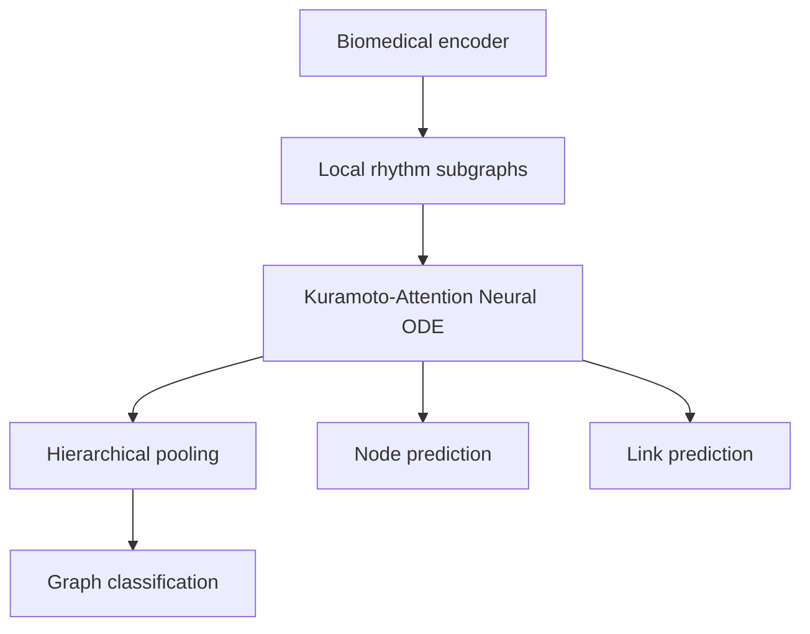

# Hierarchical Multi-Band Kuramoto Attention Neural ODE

> **Experimental research architecture; it is not a clinically validated system.**  
> **Экспериментальная исследовательская архитектура; система не прошла клиническую валидацию.**

## English

### Motivation and architecture

STEW workload windows are represented as a hierarchy: 14 EPOC electrodes (outer graph), each containing five rhythm nodes (delta, theta, alpha, beta, gamma). The biomedical encoder maps six interpretable features into oscillator states. Latent dimension zero is explicitly angular; other dimensions are generic features. Kuramoto coupling synchronizes angular states, whereas GRAND diffuses the entire representation. A learned gate combines them inside a genuine continuous vector field integrated with reproducible RK4.



Contracts are raw `[batch, channels, samples]`, rhythm features `[batch, regions, 5, 6]`, and oscillator states `[batch, regions*5, hidden]`. Features are log and relative band power, analytic amplitude, Hilbert phase sine/cosine, and spectral entropy. Power is never interpreted as phase. Typed edges cover same-band spatial and local cross-frequency connections. Two-level masked attention pools rhythms then electrodes. Heads predict workload/condition, reconstruct masked node features, and decode links from `u || v || |u-v| || u*v`.

### How the code works

The end-to-end data path is deliberately explicit so that every scientific assumption can be tested independently:

1. **Discover and label recordings.** `data/stew.py` recursively finds STEW text files below `data_root`, extracts subject and high/low condition metadata from filenames, checks that each recording has 14 channels, and never falls back to synthetic data.
2. **Create windows and rhythm features.** `data/preprocessing.py` splits a recording into overlapping `[channels, samples]` windows. Welch spectra and band-pass/Hilbert transforms produce six features for each channel and band: log power, relative power, analytic amplitude, phase sine, phase cosine, and spectral entropy. `TrainNormalizer` is fitted only after the subject split and records which training subjects contributed statistics.
3. **Build the hierarchy.** `data/graph_builder.py` maps `(electrode, band)` to the flat node index `electrode * 5 + band`. Same-band spatial edges connect electrodes, while local cross-frequency edges connect the five rhythms inside an electrode. Batched graphs are offset so that samples remain disconnected.
4. **Encode initial conditions.** `models/encoder.py` applies a separate learned projection for each band, adds a learned region embedding and a residual feature projection, and initializes latent coordinate zero from `atan2(sin_phase, cos_phase)`. Only that coordinate is treated as an angle; the remaining coordinates are ordinary latent features.
5. **Integrate continuous dynamics.** `models/ode_func.py` predicts natural frequencies from the input state, computes edge-normalized attention, and combines bounded Kuramoto coupling with GRAND diffusion through a learned gate. Cross-frequency coupling and a small time-conditioned neural residual are optional ablations. `models/ode_solver.py` integrates this explicit derivative with Euler or differentiable RK4, counts vector-field evaluations, and stops with a diagnostic if a state becomes non-finite.
6. **Pool and predict.** `models/pooling.py` first pools five band nodes into every electrode and then pools electrodes into the sample embedding; missing electrodes are masked before softmax. `models/full_model.py` sends this embedding to the graph classifier and sends node states to feature-reconstruction and link-decoding heads. The link decoder uses `z_u || z_v || |z_u-z_v| || z_u*z_v`.
7. **Train and evaluate without leakage.** `training/losses.py` combines switchable graph, node, and edge losses. `data/splits.py` keeps subjects disjoint, `training/metrics.py` computes classification/calibration/link metrics, and `analysis/` contains dynamics summaries and PNG/SVG plotting helpers. Config files hold experiment choices rather than hiding them in module globals.

During training, gradients pass from any enabled head through pooling or node decoding, the ODE solver and every vector-field evaluation, attention/coupling/frequency parameters, and finally the biomedical encoder. Integration is therefore part of the computational graph rather than a sequence of ordinary residual layers.

### Repository structure and why it is organized this way

```text
hmb_kuramoto_ode/
├── contracts.py             # shared tensor/graph invariants
├── config.py, cli.py        # configuration loading and user entry points
├── data/                    # STEW I/O, signal features, graphs, splits
├── models/                  # encoder, dynamics, solver, pooling, heads
├── training/                # losses and task metrics
├── analysis/                # dynamics diagnostics and figures
└── utils/                   # deterministic, model-independent helpers
examples/                    # small executable concepts before the full model
examples/notebooks/          # the same concepts as standalone, plotted Colab notebooks
configs/                     # reproducible synthetic/debug/full settings
tests/                       # shape, gradient, stability and leakage contracts
```

The boundaries follow the experimental lifecycle rather than placing everything in one notebook:

- **`data/` does not import training code.** Signal processing and split provenance can be audited without constructing a neural network, which reduces accidental leakage.
- **`models/ode_func.py` and `models/ode_solver.py` are separate.** The same physical vector field can be compared under Euler, RK4, or a future optional adaptive solver without changing its equations.
- **Encoder, pooling, and heads are separate modules.** Ablations can remove Kuramoto, GRAND, attention, cross-frequency coupling, or multi-task heads without duplicating the full model.
- **`analysis/` is read-only with respect to training.** Diagnostics and plotting do not influence gradients or model selection.
- **Examples are not implicit data fallbacks.** They are explicitly synthetic teaching/smoke programs, whereas CLI commands aimed at STEW fail clearly when the dataset is missing.
- **Configs separate debug and scientific runs.** `stew_debug.yaml` is intentionally small and labelled as a smoke test; `stew_full.yaml` exposes the subject-independent protocol and output settings.
- **Tests mirror scientific failure modes.** They check not only Python behavior but also neighbor normalization, graph isolation, finite gradients, coupling bounds, masked pooling, reproducibility, and subject leakage.

This separation also makes extension safer: a new biomedical modality normally replaces or extends `data/` and its graph contract while reusing the ODE, pooling, task heads, training metrics, and analysis layers.

### Dataset and leakage prevention

Place the separately obtained STEW files below any configurable directory (spaces are supported):

```text
/path/to/STEW/
  sub01_hi.txt
  sub01_lo.txt
  ...  # each recording has 14 EEG columns
```

Dataset files are neither bundled nor cached in Git. Discovery is recursive and missing data produces an actionable error; real-data commands never substitute synthetic data. STEW files, channel count, and subjects are discovered rather than hard-coded (the repository started with only a license, so no prior loader was reusable). The implementation uses the commonly documented EPOC 14-channel order and configurable 128 Hz default; verify these against the metadata accompanying your copy.

Splits use subjects as groups. Normalizers record and fit only training-subject statistics. Validation/test subjects remain disjoint; functional connectivity must be computed per sample or within each training fold. Negative links are canonical undirected pairs without positives, reversals, or duplicates. Early stopping and model selection belong exclusively to validation subjects.

### What STEW is, and what `ratings.txt` contains

STEW ("Simultaneous Task EEG Workload") is the public Lim, Sourina & Wang (2018) dataset used throughout this repository. 48 participants each completed two ~2.5-minute sessions on a 14-channel Emotiv EPOC headset at 128 Hz: a resting/low-workload baseline and the SIMKAP multitasking test, a demanding condition designed to raise cognitive load. Each session is one text file, `subNN_hi.txt` (high workload, SIMKAP) or `subNN_lo.txt` (low workload, rest), with 14 numeric EEG columns and no reliable header. The binary label used everywhere in this codebase — `STEWRecord.label` in `data/stew.py` — comes only from that `hi`/`lo` filename suffix.

`ratings.txt` is separate, subject-level metadata from the original release: after each session, participants self-rated perceived mental workload on a 1–9 scale (a single-item, NASA-TLX-style rating), giving one line per subject as `subject_id, rating_lo, rating_hi`. It is *not* used to train or label anything here — `condition_from_path` and `discover_stew` in `data/stew.py` deliberately return `None` for it (and for any other file without an explicit `hi`/`lo` marker) so it can never be parsed as if it were a 14-channel recording; `tests/test_pipeline.py::test_stew_discovery_ignores_ratings_metadata` pins that behavior. It is kept only as reference data for anyone who wants to compare the model's predictions against participants' own subjective workload reports. Subjects `05`, `24`, and `42` have no line in `ratings.txt` because their self-report data was incomplete in the original release, even though their EEG recordings are present under `dataset/`.

This checkout already includes a local copy of STEW: the `dataset/` directory (96 recordings, one pair per subject) and `ratings.txt` are committed to this repository's git history, even though `dataset/` is also listed in `.gitignore` — the ignore rule only stops *new*, untracked files from being added there again, it does not untrack files already committed. In other words, the commands below work immediately against `--data-root dataset` without downloading STEW separately; a checkout that starts from a history without that data still needs to supply its own copy the way the rest of this section describes.

### Installation and commands

```bash
python -m pip install -e '.[dev]'
python -m hmb_kuramoto_ode.cli inspect-data --data-root '/path with spaces/STEW'
python -m examples.vanilla_01_message_passing
python -m examples.vanilla_02_gat
python -m examples.vanilla_03_grand
python -m examples.vanilla_04_kuramoto
python -m examples.vanilla_05_neural_ode
python -m examples.vanilla_06_synthetic_multitask
pytest -q
python -m hmb_kuramoto_ode.cli train --config configs/stew_debug.yaml data.data_root='/path/to/STEW'
python -m hmb_kuramoto_ode.cli cross-validate --config configs/stew_full.yaml data.data_root='/path/to/STEW'
python -m examples.stew_real_experiment --data-root '/path/to/STEW' --model gat --epochs 20
python -m examples.stew_real_experiment --data-root '/path/to/STEW' --model full --epochs 20
```

Module execution is recommended, but direct execution is also supported from any working directory:

```bash
python examples/stew_real_experiment.py --data-root '/path/to/STEW' --model gat --epochs 20
```

If the project was not installed with `python -m pip install -e '.[dev]'`, the direct script adds the repository root to `sys.path` before importing `hmb_kuramoto_ode`. This addresses `ModuleNotFoundError: No module named 'hmb_kuramoto_ode'`; scientific dependencies still need to be installed normally.

STEW text files may be whitespace-, comma-, semicolon-, or tab-delimited. The loader detects these formats, ignores a textual header, and accepts one leading monotonic sample/time column while still requiring exactly 14 EEG channels. Thus CSV rows such as `1, ...` no longer fail with `could not convert string '1,' to float32`. If parsing still fails, the raised error reports the detected delimiter and numeric shape rather than silently dropping columns.

Only files with an explicit high/low condition marker in their name (for example, `sub01_hi.txt` and `sub01_lo.txt`) are treated as EEG recordings. Tables such as `ratings.txt`, `labels.txt`, or other text metadata are ignored rather than passed to the 14-channel loader. If no condition-named recordings are found, the discovery error lists the ignored files to help diagnose the dataset layout.

The full configuration specifies grouped cross-validation, checkpoints, fold predictions, metrics, PNG/SVG plots, early stopping, and mixed precision on CUDA. RK4 has no optional dependency; `torchdiffeq` is optional. Outputs must stay under `outputs/` and should include loss/dynamics curves, ROC/PR, confusion matrices, attention, gates, synchronization, and predicted connectivity. Baseline names and ablation switches cover MLP, GCN, GAT, GRAND, Kuramoto variants and the full model; compute-intensive real-data results are deliberately not claimed here.

### Interactive Colab notebooks

[`examples/notebooks/`](examples/notebooks/) has a self-contained, runnable Jupyter notebook for each concept above, meant to be opened directly in Google Colab (each has an "Open in Colab" badge) rather than read as a script. Every notebook clones just what it needs, uses the real project modules (not a reimplementation), and plots what it computes:

```text
examples/notebooks/
├── 01_message_passing.ipynb    # spreading a signal across the hierarchical graph, no learning
├── 02_gat_attention.ipynb      # EdgeAttention's segment softmax, trained on a toy task
├── 03_grand_diffusion.ipynb    # GRAND-style feature diffusion and its variance decay
├── 04_kuramoto_sync.ipynb      # order parameter, sync phase transition, unit-circle snapshots
├── 05_neural_ode.ipynb         # Euler vs RK4 convergence order, backprop through the solver
├── 06_synthetic_multitask.ipynb  # the full HierarchicalKuramotoODE, three heads, ablations
└── 07_stew_real_experiment.ipynb # real STEW windows, subject-disjoint GAT vs. full training
```

Notebooks 01-06 use a sparse, blobless clone so they skip the bundled dataset entirely; 07 needs the real recordings, so it clones the full history (or accepts a Google Drive path instead, if you already have your own STEW copy). All seven were executed end-to-end while writing this README, produce their own plots, and report honestly modest STEW accuracy on the small, fast configuration they run by default — see each notebook's closing cell for how to scale up to the full protocol.

### Architecture report

The committed [`reports/`](reports/README.md) directory contains a reproducible architecture overview and a [three-task synthetic smoke-metrics report](reports/synthetic_metrics.md). The latter separately reports node regression, link prediction, and graph prediction; it includes ROC-AUC and confusion matrices where they are defined and clearly distinguishes fixed-fixture smoke measurements from STEW results.

The [real STEW experiment status](reports/real_stew_status.md) documents the subject-disjoint GAT/full-model runner and its output files. Real metrics are written only after loading actual STEW recordings; a network or dataset failure is never replaced with synthetic measurements.

### Reproducibility, limitations, and extension

Seeds are deterministic; CPU smoke examples report measured loss/dynamics. Functional connectivity and workload accuracy depend on the exact STEW distribution and must be evaluated subject-independently. No superiority, image/genomics validation, or clinical usefulness is claimed. To add a biomedical modality, implement a loader yielding `[regions, bands_or_views, features]`, define typed within/between-region edges, preserve an explicit angular feature only when physically meaningful, and retain grouped split/fit contracts.

## Русский

### Мотивация, модель и задачи

Каждое окно STEW представлено иерархическим графом: внешний уровень — электроды, внутренний — пять ритмов. Обучаемый кодировщик создаёт начальное состояние; нулевая координата является физической фазой, остальные — латентными признаками. Связь Курамото синхронизирует фазы, GRAND сглаживает все признаки, а обучаемый шлюз смешивает производные в непрерывном поле RK4. Иерархический attention сначала объединяет ритмы, затем электроды. Реализованы классификация графа, самоконтролируемое восстановление узлов и реконструкция связей.

### Как работает код

Поток данных разделён на проверяемые этапы. `data/stew.py` находит записи и извлекает испытуемого и условие; `data/preprocessing.py` создаёт окна и шесть физиологически интерпретируемых признаков для каждой пары «электрод–ритм». После группового разбиения `TrainNormalizer` обучается только на тренировочных субъектах. `data/graph_builder.py` создаёт узел с индексом `электрод * 5 + ритм`, внутрилокальные межчастотные рёбра и пространственные рёбра одинаковых диапазонов.

`models/encoder.py` преобразует признаки в начальные состояния осцилляторов, причём только координата 0, полученная из `atan2(sin_phase, cos_phase)`, имеет угловой смысл. `models/ode_func.py` вычисляет частоты, attention, ограниченные связи Курамото, диффузию GRAND, шлюз и нейронный остаток. `models/ode_solver.py` интегрирует именно производную непрерывного времени методом RK4 или Euler и сохраняет граф вычислений для обратного распространения. Затем `models/pooling.py` объединяет ритмы и электроды, а три головы выполняют классификацию графа, восстановление узлов и предсказание связей.

### Почему репозиторий имеет такую структуру

Каталоги соответствуют стадиям эксперимента: `data/` отвечает только за данные, признаки, графы и разбиения; `models/` — за обучаемую архитектуру; `training/` — за функции потерь и метрики; `analysis/` — за диагностику и рисунки. Поле ODE отделено от решателя, поэтому численный метод можно менять, не меняя физические уравнения. Кодировщик, pooling и головы разделены для корректных абляций. `examples/` содержит только явно синтетические учебные запуски, `configs/` отделяет быстрый debug от полного протокола, а `tests/` проверяет математические и анти-утечечные инварианты. Такая организация позволяет заменить загрузчик для другой биомедицинской модальности, не переписывая динамику и оценивание.

### Данные и защита от утечки

Разбиение выполняется только по испытуемым. Статистики нормализации обучаются на тренировочных субъектах, валидация отделена от теста, отрицательные рёбра уникальны и не пересекаются с положительными. Случайное разделение окон одного человека запрещено и проверяется тестом.

### Что такое STEW и что содержит `ratings.txt`

STEW ("Simultaneous Task EEG Workload") — общедоступный датасет Lim, Sourina и Wang (2018), на котором построен весь репозиторий. 48 испытуемых прошли по две сессии длительностью около 2,5 минут на 14-канальном шлеме Emotiv EPOC с частотой дискретизации 128 Гц: сессию покоя/низкой нагрузки и сессию теста SIMKAP — многозадачного упражнения, повышающего когнитивную нагрузку. Каждая сессия — отдельный текстовый файл: `subNN_hi.txt` (высокая нагрузка, SIMKAP) или `subNN_lo.txt` (низкая нагрузка, покой), с 14 числовыми столбцами ЭЭГ и без надёжного заголовка. Бинарная метка, используемая во всём коде (`STEWRecord.label` в `data/stew.py`), берётся исключительно из суффикса `hi`/`lo` в имени файла.

`ratings.txt` — отдельные метаданные уровня испытуемого из оригинального релиза датасета: после каждой сессии участники сами оценивали воспринимаемую умственную нагрузку по шкале от 1 до 9 (аналог одного пункта NASA-TLX), по одной строке на испытуемого в формате `subject_id, rating_lo, rating_hi`. Этот файл **не используется** ни для обучения, ни для разметки: `condition_from_path` и `discover_stew` в `data/stew.py` намеренно возвращают `None` для него (и для любого другого файла без явного маркера `hi`/`lo`), чтобы он никогда не был разобран как 14-канальная запись; это поведение закреплено тестом `tests/test_pipeline.py::test_stew_discovery_ignores_ratings_metadata`. Файл сохранён лишь как справочные данные для тех, кто хочет сопоставить предсказания модели с субъективными самооценками нагрузки участников. У испытуемых `05`, `24` и `42` нет строк в `ratings.txt`, поскольку их самооценки в оригинальном релизе оказались неполными — хотя их ЭЭГ-записи присутствуют в `dataset/`.

В этом чекауте уже есть локальная копия STEW: каталог `dataset/` (96 записей, по паре на каждого испытуемого) и `ratings.txt` закоммичены в историю репозитория, несмотря на то что `dataset/` также перечислен в `.gitignore` — правило игнорирования лишь не даёт добавлять *новые* неотслеживаемые файлы в этот каталог повторно и не снимает с учёта уже закоммиченные файлы. Иначе говоря, команды ниже сразу работают с `--data-root dataset` без отдельной загрузки STEW; при чекауте из истории без этих данных STEW нужно получить отдельно, как описано выше.

### Запуск, результаты и ограничения

Команды установки, примеров, тестов и полного эксперимента приведены выше. `stew_debug.yaml` — только быстрая CPU-проверка трёх голов, а `stew_full.yaml` — воспроизводимая групповая кросс-валидация с ROC/PR, confusion matrix, предсказаниями и PNG/SVG-графиками. Без локальных STEW-файлов реальные метрики не публикуются. Для новой биомедицинской модальности нужен загрузчик с тем же контрактом, осмысленные типы рёбер и строго групповый протокол; наличие фазы нельзя выдумывать для изображений или геномики.

В каталоге [`reports/`](reports/README.md) находится воспроизводимая схема архитектуры и [отчёт по трём синтетическим smoke-задачам](reports/synthetic_metrics.md): восстановлению узлов, предсказанию рёбер и классификации графа. ROC-AUC и confusion matrix приведены только для бинарных задач; отчёт явно отделяет эти фиксированные проверки от результатов STEW.

### Интерактивные ноутбуки Colab

В [`examples/notebooks/`](examples/notebooks/) для каждой идеи выше есть отдельный самодостаточный Jupyter-ноутбук, рассчитанный на запуск прямо в Google Colab (у каждого есть значок «Open in Colab»), а не на чтение как скрипт: 01 — распространение сигнала по иерархическому графу без обучения, 02 — обучаемый segment softmax в `EdgeAttention`, 03 — диффузия признаков в духе GRAND, 04 — синхронизация Курамото и переход через параметр порядка, 05 — сходимость Euler/RK4 и обратное распространение через решатель, 06 — полная модель `HierarchicalKuramotoODE` с тремя головами и абляциями, 07 — обучение GAT и полной модели на реальных окнах STEW с групповым разбиением по испытуемым. Ноутбуки 01–06 используют разреженное клонирование без бандла STEW; 07 клонирует полную историю (либо принимает путь к собственной копии STEW на Google Drive). Все семь были выполнены целиком при подготовке этого README и сохраняют собственные графики.
