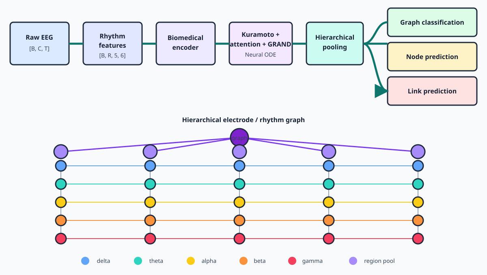

# Architecture visualization report

## Report index

- [Architecture overview](architecture_overview.svg)
- [Measured three-task synthetic smoke metrics](synthetic_metrics.md)
- [Machine-readable smoke metrics](synthetic_metrics.json)

The metrics report separates node reconstruction, link prediction, and graph prediction. It reports ROC-AUC and confusion matrices only for the two binary tasks; node reconstruction uses MAE, RMSE, and R² because it is a continuous task.



## What the PNG shows

`architecture_overview.png` is a schematic of the implemented data and model flow. It is an architecture report, **not an experimental-result plot** and does not imply measured STEW performance.

The seven pastel panels across the top, read from left to right, represent:

1. a raw EEG window `[batch, channels, samples]`;
2. six rhythm features `[batch, regions, 5, 6]`;
3. the biomedical encoder and its initial oscillator state;
4. the Kuramoto-attention-GRAND Neural ODE;
5. masked hierarchical pooling;
6. graph classification and node reconstruction (upper output);
7. link prediction (lower output).

The lower diagram expands the hierarchical graph:

- each vertical column is one electrode or region;
- blue, turquoise, yellow, orange, and red nodes are delta, theta, alpha, beta, and gamma rhythms respectively;
- vertical gray edges are local cross-frequency connections inside a region;
- colored horizontal edges are same-band spatial connections between regions;
- light-purple nodes are region embeddings produced by rhythm pooling;
- the dark-purple node is the graph embedding produced by region pooling.

Only five representative regions are drawn to keep the figure readable. A standard 14-channel STEW sample has 14 columns and therefore `14 × 5 = 70` rhythm nodes. The runtime graph builder creates the complete configured graph; the illustration is not used as model input.

## Why the figure contains no embedded labels

The visualization is generated exclusively with the Python standard library so documentation can be reproduced in a minimal checkout without Matplotlib, Pillow, a browser, or system fonts. The semantic legend is kept in this Markdown file, where it remains searchable, accessible to screen readers, and easy to translate.

## Reproduce the PNG

From the repository root, run:

```bash
python reports/generate_architecture.py
```

The generator writes a deterministic 1200 × 680 RGB PNG to `reports/architecture_overview.png`. It draws the pipeline, typed rhythm edges, two pooling levels, and task branches directly into a pixel buffer and encodes it with the standard-library `struct` and `zlib` modules. No dataset is opened and no result is fabricated.

The text-based `architecture_overview.svg` preview is committed because this review system does not accept binary files. The equivalent PNG is generated locally and ignored by Git, avoiding binary-diff failures while preserving the requested PNG workflow. Generated training outputs, checkpoints, subject predictions, and dataset-derived plots belong under the ignored `outputs/` directory unless a future review explicitly approves their inclusion.

## Связь с архитектурой

Верхняя строка показывает путь от окна EEG через признаки, кодировщик, непрерывную динамику и pooling к трём задачам. В нижней части каждый столбец соответствует электроду, пять цветов — ритмам delta/theta/alpha/beta/gamma, серые вертикальные линии — локальным межчастотным связям, а цветные горизонтальные — пространственным связям одного диапазона. Светло-фиолетовые узлы обозначают представления электродов, тёмно-фиолетовый — представление всего графа. Это схема архитектуры, а не график качества или клинический результат.
