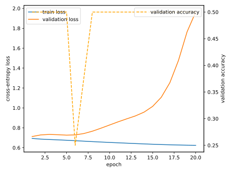

# Real STEW GAT report

Subject-disjoint split: `{'train': ['01', '02', '03', '04', '05', '06', '07', '08', '09', '10', '11', '12', '13', '14', '15', '16', '17', '18', '19', '20', '21', '22', '23', '24', '25', '26', '27', '28', '29', '30', '31', '32', '33', '34', '35', '36', '37', '38', '39', '40', '41', '42', '43', '44', '45', '46'], 'validation': ['47'], 'test': ['48']}`.

- ROC-AUC: `0.8125`
- Accuracy: `0.5`
- Confusion matrix (rows=true, columns=predicted): `[[4, 0], [4, 0]]`

