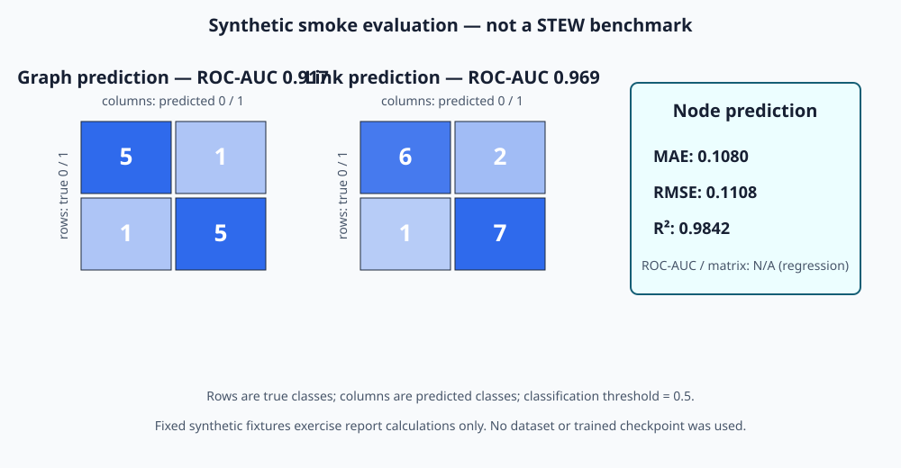

# Three-task synthetic smoke metrics

> **Scope:** measured from deterministic fixtures in `run_synthetic_metrics.py`; these are not STEW results and were not produced by a trained checkpoint.



## 1. Node prediction — masked-feature reconstruction

This is a continuous regression task, so ROC-AUC and a confusion matrix are not mathematically applicable without inventing a thresholded label.

| Metric | Measured value |
|---|---:|
| Values | 10 |
| MAE | 0.108000 |
| RMSE | 0.110815 |
| R² | 0.984208 |
| ROC-AUC | N/A — regression |
| Confusion matrix | N/A — regression |

## 2. Link prediction — binary edge reconstruction

| Metric | Measured value |
|---|---:|
| Edges | 16 |
| ROC-AUC | 0.968750 |
| Accuracy at 0.5 | 0.812500 |

Confusion matrix (`rows=true [0,1]`, `columns=predicted [0,1]`):

```text
[6, 2]
[1, 7]
```

## 3. Graph prediction — binary graph classification

| Metric | Measured value |
|---|---:|
| Graphs | 12 |
| ROC-AUC | 0.916667 |
| Accuracy at 0.5 | 0.833333 |

Confusion matrix (`rows=true [0,1]`, `columns=predicted [0,1]`):

```text
[5, 1]
[1, 5]
```

## Reproduce

```bash
python reports/run_synthetic_metrics.py
```

The command uses only the Python standard library and deterministically rewrites this Markdown file, `synthetic_metrics.json`, and the text-based `synthetic_metrics.svg` visualization. Real STEW ROC-AUC and confusion matrices must be generated from held-out subjects and must not be inferred from this smoke fixture.
