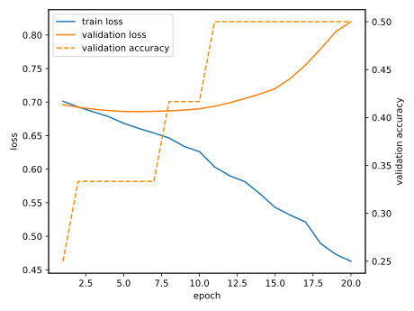
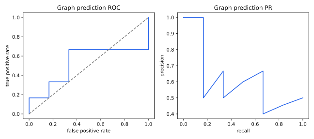
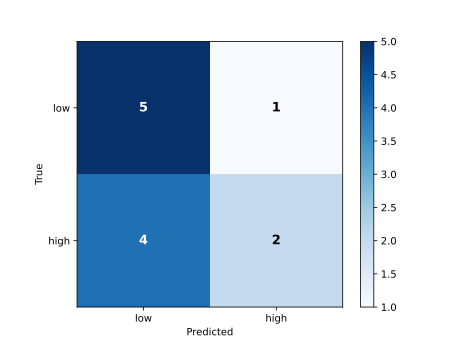
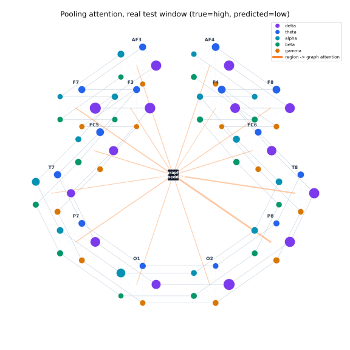

# Graph prediction — measured results

> Real STEW recordings from `dataset`, subject-disjoint split. Not a synthetic fixture.

Subjects: train=['05', '07', '11', '20', '23', '29', '37', '45'], validation=['01', '38'], test=['13', '21']
Windows: train=48, validation=12, test=12

| Metric | Test value |
|---|---:|
| Accuracy | 0.5833 |
| Balanced accuracy | 0.5833 |
| Macro F1 | 0.5556 |
| ROC-AUC | 0.5278 |
| AUPRC | 0.6480 |
| ECE | 0.5027 |

Confusion matrix (rows=true [low, high], columns=predicted [low, high]):

```text
[5, 1]
[4, 2]
```






## Reproduce

```bash
python tasks/graph_prediction/evaluate.py --data-root dataset
```
