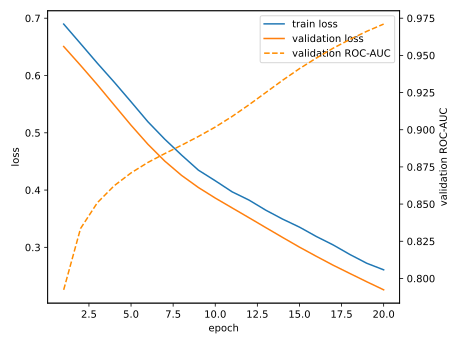
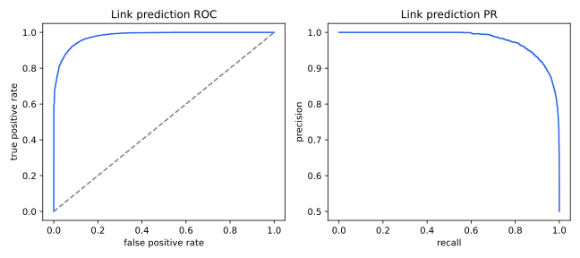
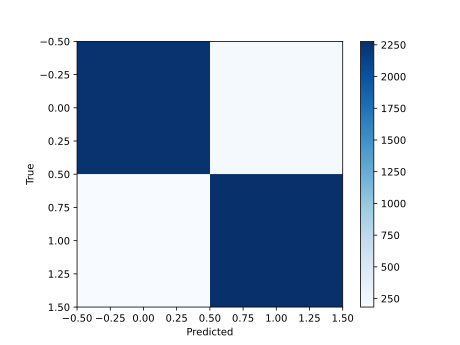

# Link prediction — measured results

> Real STEW recordings from `dataset`, subject-disjoint split. Not a synthetic fixture.
> Edge identity (positive/negative) is fixed by the hierarchical topology; only the
> node embeddings that decode it come from real, window-specific EEG dynamics.

Subjects: train=['05', '07', '11', '20', '23', '29', '37', '45'], validation=['01', '38'], test=['13', '21']
Windows: train=48, validation=12, test=12

| Metric | Test value |
|---|---:|
| Edges evaluated | 4920 |
| ROC-AUC | 0.9795 |
| Average precision | 0.9802 |
| Accuracy at 0.5 | 0.9193 |

Confusion matrix (rows=true [no-edge, edge], columns=predicted [no-edge, edge]):

```text
[2246, 214]
[183, 2277]
```





## Reproduce

```bash
python tasks/link_prediction/evaluate.py --data-root dataset
```
