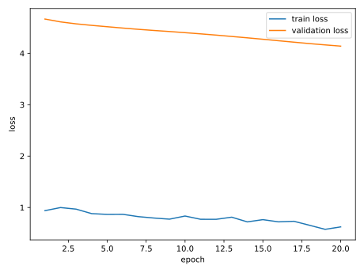
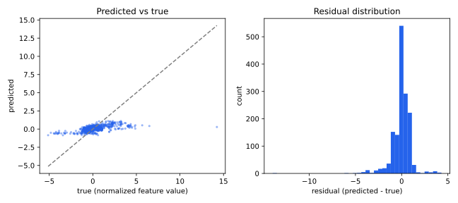
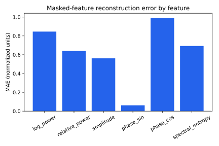
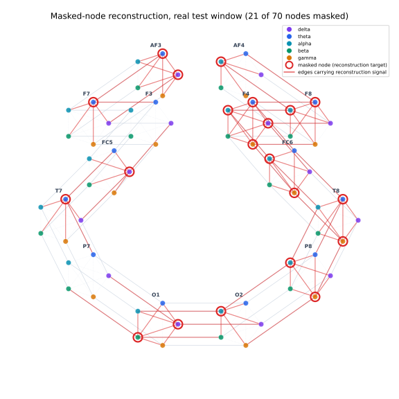

# Node prediction — measured results

> Real STEW recordings from `dataset`, subject-disjoint split. Not a synthetic fixture.
> Regression task: ROC-AUC and a confusion matrix are not defined for continuous reconstruction.

> **R² caveat:** phase_sin has near-zero variance in this small test set after normalization, so its true-value variance in the R² denominator is close to zero and a handful of small absolute errors produce a very large negative per-feature R². The aggregate R² above inherits that instability. MAE and RMSE, which do not divide by target variance, are the reliable headline numbers at this smoke scale.

Subjects: train=['05', '07', '11', '20', '23', '29', '37', '45'], validation=['01', '38'], test=['13', '21']
Windows: train=48, validation=12, test=12
Masked nodes: 252 of 840 (30% mask rate)

| Metric | Test value |
|---|---:|
| MAE | 0.6321 |
| RMSE | 1.0324 |
| R² | -439779753984.0000 |

MAE by feature (normalized units):

| Feature | MAE |
|---|---:|
| log_power | 0.8456 |
| relative_power | 0.6401 |
| amplitude | 0.5613 |
| phase_sin | 0.0616 |
| phase_cos | 0.9911 |
| spectral_entropy | 0.6929 |






## Reproduce

```bash
python tasks/node_prediction/evaluate.py --data-root dataset
```
